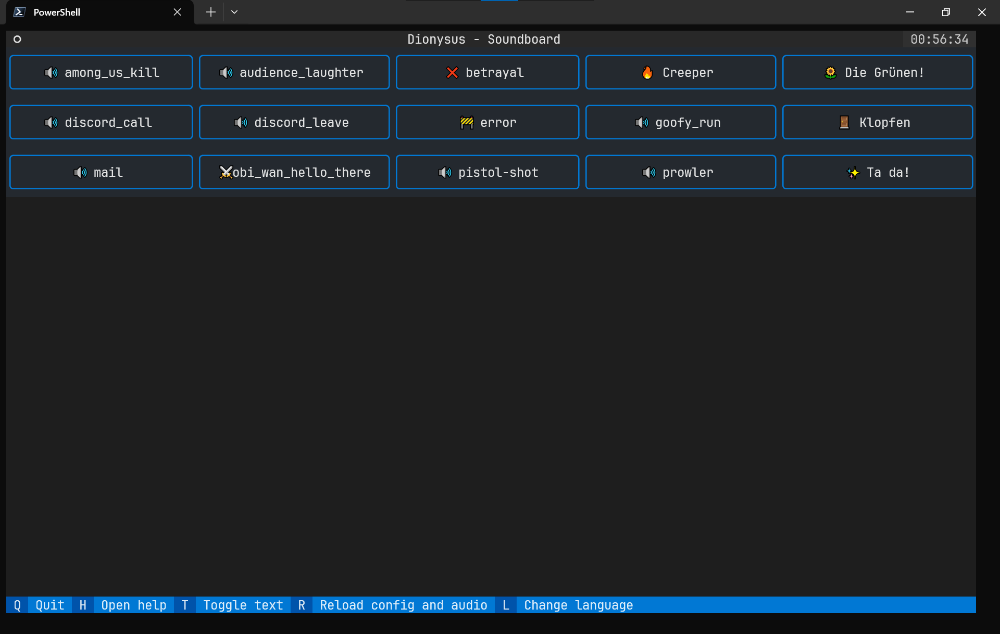
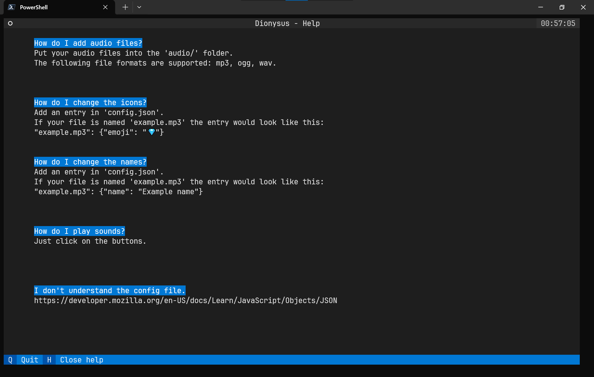

# project_dionysus

| ❗ | This project is currently being reworked. It might not be fully functional. |
|---|-----------------------------------------------------------------------------|

A simple sounboard in the terminal.

## Installation & Usage
This program needs [VB-CABLE](https://vb-audio.com/Cable/) to work.

Clone the repository: `git clone https://github.com/the-sh4d0w/project_dionysus.git`

Then install the required dependencies: `pip install -r requirements.txt`

After that just run: `python main.py`

---
Note: The audio files included in this repository are not subject to the license.
