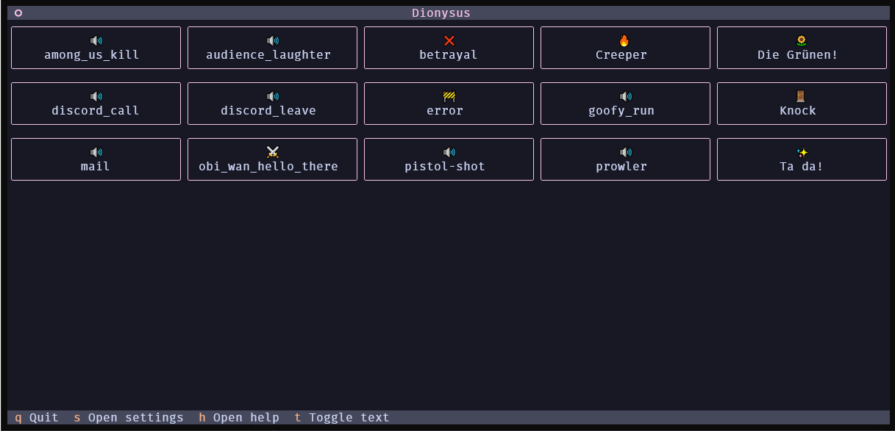
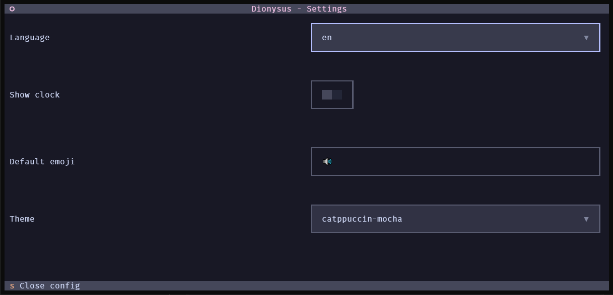
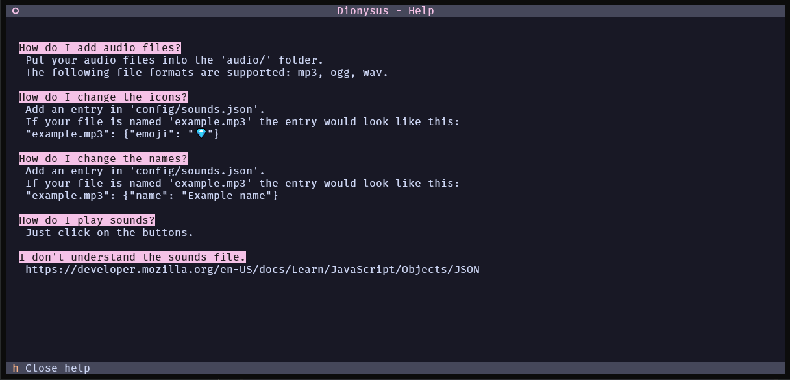
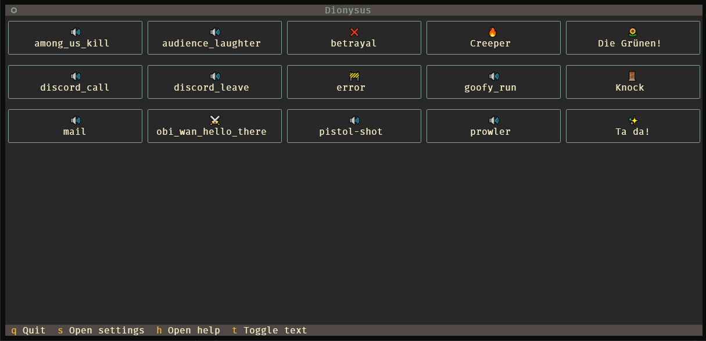
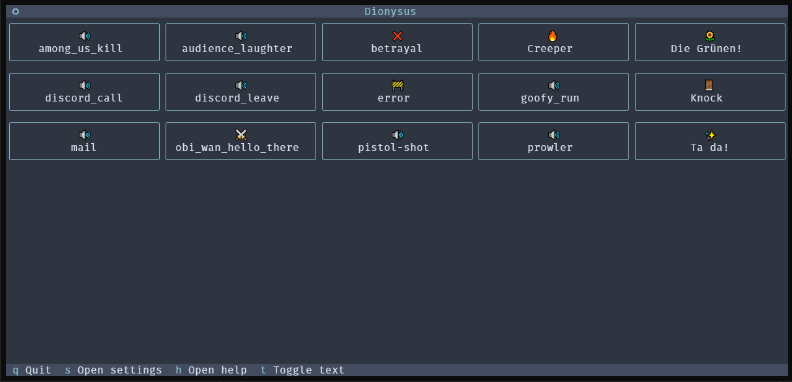
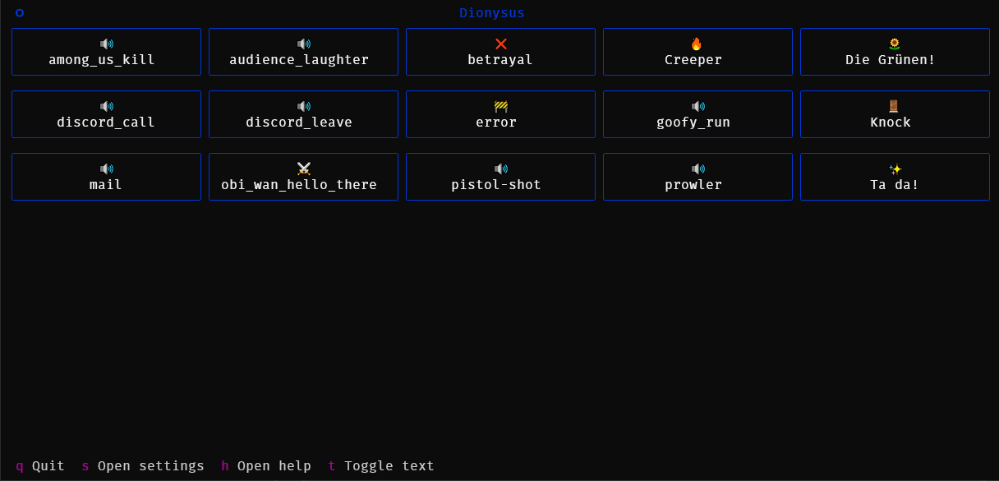
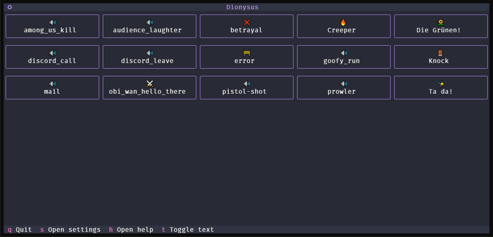

# Dionysus
A simple soundboard in the terminal. Add your own sound files and play them through your microphone to annoy your friends in voice chat.

This is a Terminal User Interface (TUI) made with [Textual](https://github.com/textualize/textual/).

## Installation & Usage
You will need a virtual output device that redirects audio to a virtual input device. [VB-CABLE](https://vb-audio.com/Cable/) works for Windows and macOS, if you're on Linux you can probably figure it out on your own.

Clone the repository: `git clone https://github.com/the-sh4d0w/project_dionysus.git`

Then install the required dependencies: `pip install -r requirements.txt`

After that just run: `python main.py`

## More screenshots

### Other themes

---
Note: The audio files included in this repository are not subject to the license.
